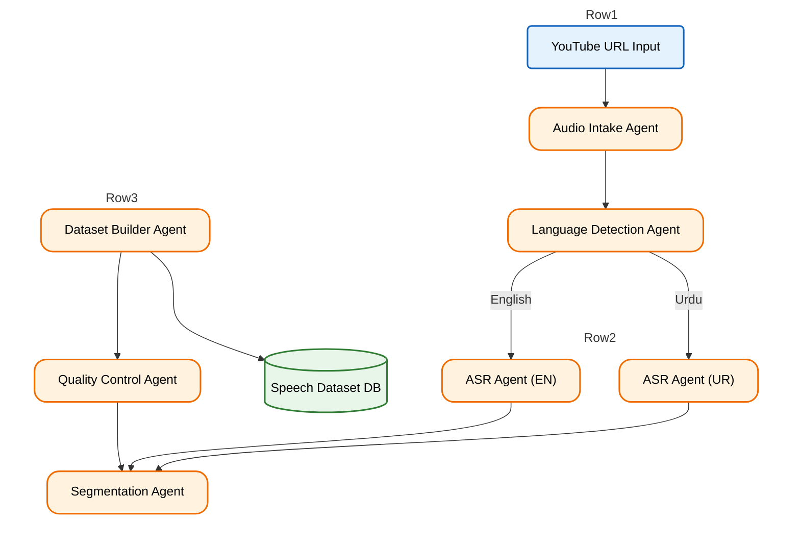

# AutoSpeechDataset

This tool will solve a major problem for generating speech datasets using youtube videos. Just input your link of video and get a tts/asr ready data in suitable format. Perfect for training speech models.

## Legal & Ethical Note

This tool is stricktly for education purpose only as YouTube cannot be redistributed freely in most cases.  

## High Level Architecture

